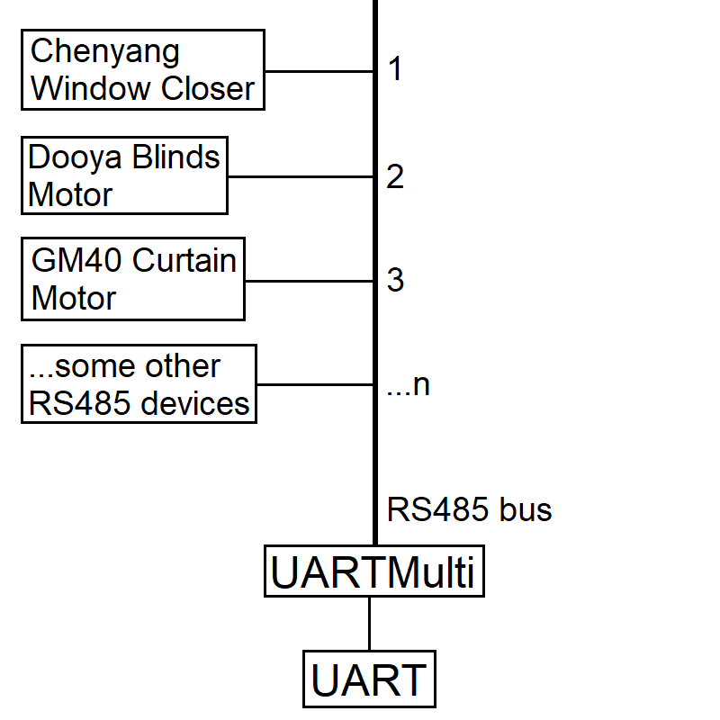

## Intro

I started this project as some of the smart home devices like automatic window closers, blinds and curtain motors I'm importing from China supports RS485, a serial communication standard that's capable of being wired in a multidrop bus.

## Problem

The current implementation of the UART bus for the ESPHome platform allows for one-to-one communication to a single serial device. This means there needs to be one ESP8266/32 module for each smart home device in a premises (i.e. one for each door, window, blinds, curtain, lighting, aircon etc.) which quickly congests the WiFi network.

## Solution

We can leverage RS485 to link up multiple devices to a single ESP8266/32 controller. The architecture of the ESPHome platform allows for integrations to exist as its own class. That means an integration can be written for each RS485-enabled smart home device, which all interface with a middleware 'hub' component.

For all data that is received on the UART bus, the hub component forwards them verbatim to every instantiated instance of RS485 integrations. These integrations process the bytes into frames and act accordingly when it's a valid frame addressed to it.

All sending is also done through the hub component, with frames enqueued to be transmitted on the UART bus whenever the RS485 bus is available (i.e. when not awaiting a response from a RS485 device).

## Result