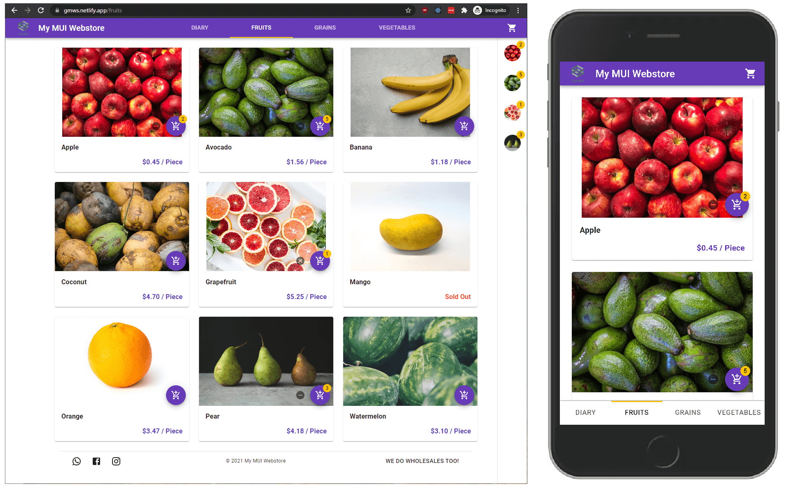

## Problem

When a client wishes to set-up a webstore, there are many options nowadays. Small business owners without a web development team usually contract a freelancer or web development firm to do it for them. [Shopify](https://www.shopify.com/) and [WooCommerce](https://woocommerce.com/) are two of the most popular platforms deployed. Such projects are usually a one-off thing and once the developer receives payment, unless there is a maintenance contract, the system is handed over to the customer to manage.

Self-hosted sites like WooCommerce, which is based on WordPress, usually have an always-running backend that serves the pages by collecting data from a database and builds the page on demand each time a user requests it. We call such sites “dynamically-generated” sites. On budget hosting plans, this usually **results in a very slow browsing experience** for customers.

The presence of an exposed backend and database also presents an **ever-increasing risk of breach of customer data**, since most clients will not have the technical know-how to keep the WordPress packages up-to-date against the latest security vulnerabilities.

## Solution

A client approached me to build a webstore to take small-volume online orders. **Budget** and **ease-of-use** were their primary concern. Given my experience with building basic blog sites with [GatsbyJS](https://www.gatsbyjs.com/) and [React](https://reactjs.org/), and upon learning about the [JAMStack](https://jamstack.org/) concept, I was inspired to address the above concerns by building a statically-generated webstore.

I have chosen GatsbyJS as the frontend, and [Node.js](https://nodejs.org/en/) lambda functions running on [Netlify](https://www.netlify.com/)'s [serverless functions](https://www.netlify.com/products/functions/) service as the backend to process the orders. To manage the products listings in the webstore, there are **no unfamiliar UIs** for the client to learn as the webstore is completely API-based and thus able to be managed using Google Apps such as Drive, Docs, Sheets and Gmail.

