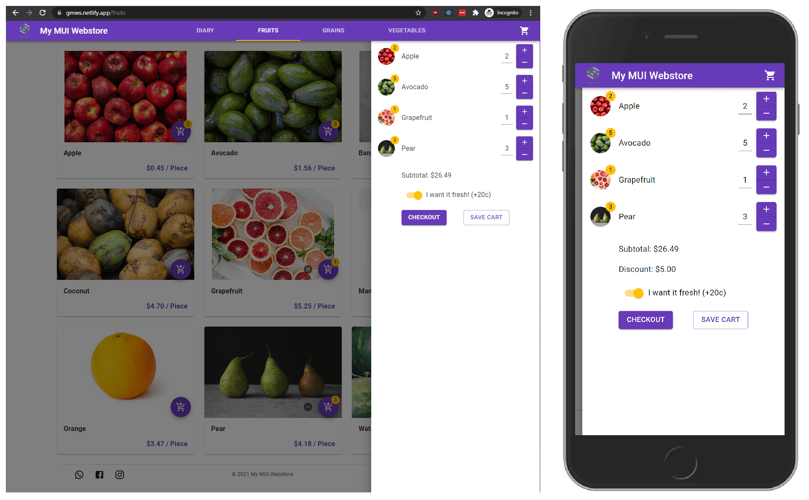

## Intro

There are many options nowadays to set-up a webstore. Small business owners usually contract a freelancer or web development firm to do it for them. [Shopify](https://www.shopify.com/) and [WooCommerce](https://woocommerce.com/) are two of the most popular platforms deployed. Such projects are usually a one-off thing and once the site is up, unless there is a maintenance contract, the system is handed over to the business owner to manage.

A client approached me to build a webstore to list their products online and take orders. **Budget** and **ease-of-use** were their primary concerns. Their requirements were for it to have a fast, modern and user-friendly interface, be mobile responsive, Search Engine Optimized (SEO), and easy to self-manage the product listings.

## Problem

Self-hosted sites like WooCommerce, which is based on WordPress, usually have an always-running backend that connects to a database to build and serve a page on each request. On budget hosting plans with limited server resources, this usually **results in a very slow browsing experience** for customers.

The presence of an exposed backend and database also presents a **risk of breach of customer data**, since most clients will not have the technical know-how to keep the WordPress packages [up-to-date](https://kinsta.com/blog/is-wordpress-secure/) against the latest security vulnerabilities.

## Solution

Upon learning about the benefits of Static Site Generation (SSG) and the [JAMStack](https://jamstack.org/) concept, I took to addressing the above concerns and wrote a webstore based on these technologies and opensourced it as [gatsby-mui-webstore](https://github.com/gatsbymuiwebstore/gatsby-mui-webstore). Check out the live [demo](https://gmws.netlify.app/).

The website frontend is written with [GatsbyJS](https://www.gatsbyjs.com/) + [Material-UI](https://material-ui.com/), and the order processing backend with [Node.js](https://nodejs.org/en/) [serverless lambda functions](https://www.netlify.com/products/functions/). Google Apps such as Drive, Docs, Sheets and Gmail are used to manage the products listings and orders, as such there are **no unfamiliar UIs** for the client to learn.

Changes to the product listings can be made directly on the Google Sheets database, and after clicking on the deploy button it will then trigger the site to rebuild.

During every build process, all the products data and images are pulled from Google Sheets and Drive. The HTML for every page is built at *compile-time* and ready to be served directly to browsers.

A standard Client-Side Rendered (CSR) React app built with [`create-react-app`](https://github.com/facebook/create-react-app) will show a blank screen while React loads in the browser. Search engines are not able to crawl it as the HTML contains just a bunch of JavaScript links, which severely impacts SEO.

With the Gatsby SSG, it is a form of Server-Side Rendering (SSR) where the browser fetches fully-formed HTML that was already pre-compiled at build-time and the content is immediately displayed on screen while React loads. Once it finishes loading, the page is then rehydrated with interactive or updated content. This means **blazing-fast** page load times, **faciliates SEO**, and also **eliminates the need** for an always-running backend and database to build each page on request. Running costs are also **kept to a minimum** as most static site hosters have free tiers.

The UI is designed in a simple, minimalist approach, in a snappy app-like experience with products sorted into category pages and cards representing each product and its variants. Customers browse the product listings and adds them to the cart on the right. The subtotal is updated real-time right in the browser.

The delivery fee is calculated as the customer enters in the postal code. A promo code can also be entered which will then be verified by an external serverless function. The serverless function polls the same Google Sheet to verify the type of promo it's linked to. The relevant discounts are then applied to the order if the code is valid. The order summary is updated in real-time as the customer enters in these information.

On submission, the entire order is then sent to a serverless lambda function, with the order confirmation and details being returned on successful verification. Payment instructions are also shown according to the customer's chosen payment method.

Both the webstore owner and customer receive an email of the order confirmation and details. In the webstore owner's Gmail, colored labels are automatically applied via the use of Google Apps Scripts to help manage the orders.

