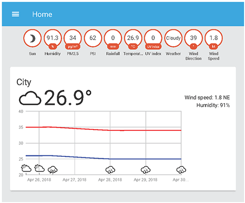
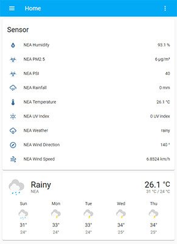
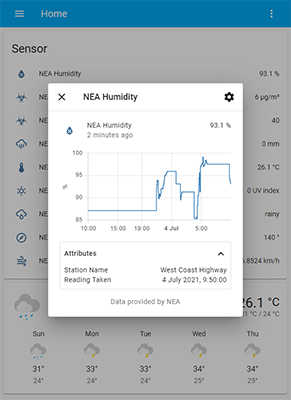
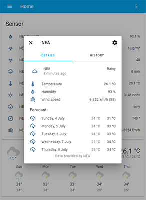
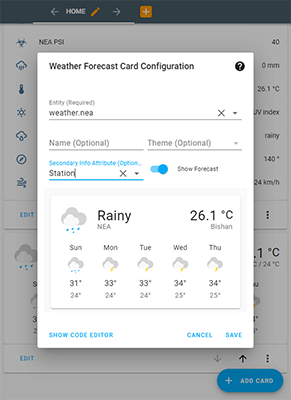

## Intro

Home Assistant is an opensource home automation platform written with Python.

In the course of my university's final year project, I have written an integration to use climate and forecast data provided by the [National Environment Agency](https://www.nea.gov.sg). It retrieves and processes the data from Data.gov.sg's [Environment API](https://data.gov.sg/dataset?groups=environment&res_format=API) and integrates them into Home Assistant.

Aside from displaying the current weather forecasts and meteorological readings, another use case can be an automation which triggers connected smart windows to automatically close when the \`rainfall\` sensor increases due to rain.

This was how it looked like back in April 2018:



I have finally got around to [submitting it](https://github.com/home-assistant/core/pull/52490) as an official integration to the Home Assistant project.

## Solution

Having refactored the code to support the latest iteration (2021.7) of home assistant, it now looks like this:



Values are automatically selected from the nearest station to the user's defined latitude and longitude coordinates. Values for each sensor entity are refreshed in real-time according to the API's update intervals.



Forecasts are displayed in a 5-day period, complete with high and low temperature ranges.





```yaml
# Example configuration.yaml entry
sensor:
  - platform: nea
    monitored_conditions:
      - 2-hour-weather-forecast
      - air-temperature
      - pm25
      - psi
      - rainfall
      - relative-humidity
      - uv-index
      - wind-direction
      - wind-speed
      
weather:
  - platform: nea
```