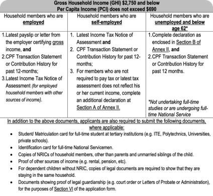
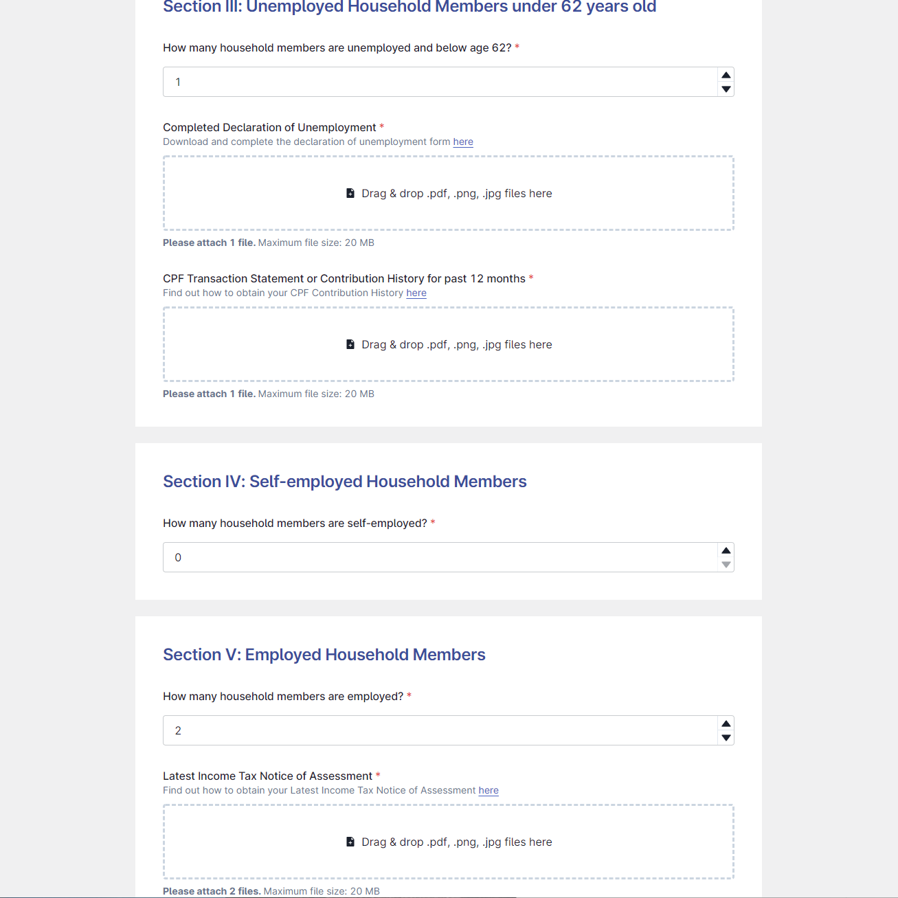

## Intro

[Open Government Products](https://www.open.gov.sg/aboutus) is an experimental tech developmental division of [GovTech](https://www.tech.gov.sg/) that's run like a fully-funded start-up company and largely free from the bureaucracies of the traditional government agencies. As such, they have wide latitude to experiment and build software utilising the latest cloud services and web frameworks.

I had the opportunity to represent [PayPal](https://www.paypal.com/) in the [2022 Hack for Public Good](https://www.open.gov.sg/hackathon/2022) hackathon, where various teams took up the challenge to prototype workable solutions to current issues faced by government agencies and the public. After some looking around, I took interest in the DocuLens project and proceeded to join the team and eventually contributed frontend code for the [MVP presented in the finale](https://www.youtube.com/watch?v=GBjewa49nk8).

## Problem

Applying for government and corporate schemes often requires a tedious amount of paperwork and documentation. Take MOE's financial assistance scheme which many different documents are conditionally required based on each household member's finanicial status.

*In a large household, the number of documents required for MOE FAS can easily get overwhelming*

In a household of 6, here's an applicant will have to consolidate and submit upwards of 20 documents:

| Member  | Employment Status | Age   | No. of Docs Required |
| ------- | ----------------- | ----- | -------------------- |
| Father  | Employed          | 54    | 5                    |
| Mother  | Unemployed        | 52    | 4                    |
| Child 1 | Student           | 24    | 2                    |
| Child 2 | Employed          | 22    | 5                    |
| Child 3 | NS                | 20    | 2                    |
| Child 4 | Student           | 18    | 2                    |
|         |                   | Total | 20                   |

All documents submitted have to be manually checked against the criteria, and there's usually missing or invalid submissions that has to be resubmitted. This usually result in a convoluted chain of back-and-forth emails between the applicant and the public official which can quickly get messy.

## Solution

DocuLens is an integrated platform to streamline the application process:

1. An applicant fills a dynamic form created using a FormsSG-like form builder. The user answers a series of questions and the appropriate file upload dropzones are automatically invoked depending on the response. This leaves out the guesswork and the applicant knows exactly which documents are required.
2. Once the form and all its required documents are submitted, it appears in a dashboard for the officers to verify. Any improper submissions can then be flagged and the applicant notified to resubmit.

3. Once the